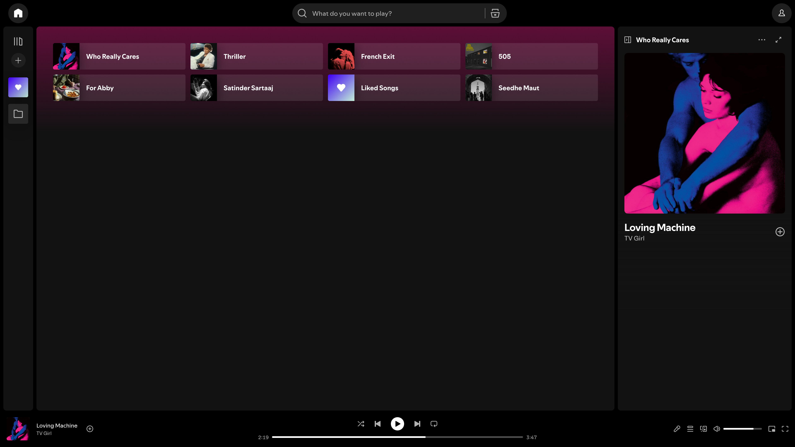
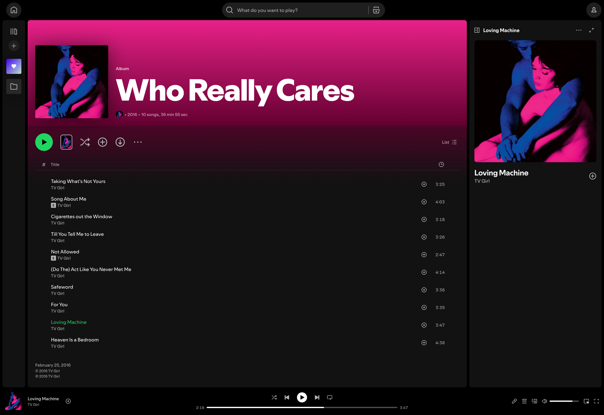

# CLEAN SPOTIFY

Your music, zero distractions, without the clutter.

 

 

<i>Homepage</i>

 
 

<i>Now Playing</i>

 
 

<i>Artist Page</i>

 
 

<i>Album Page</i>

 

## Installation

> [!WARNING]
> Spotify uses dynamic class names - the userstyle may break after updates. In that case, you can check the [Class Dictionary](CLASS_DICTIONARY.md) or head down to the [Contributing & Bug Reports](#contributing--bug-reports) section to help patch it or report the issue.

Follow these steps to set up the userstyle:

#### Step 1: Install a Userstyle Manager
Before installing the theme, you need a browser extension that handles custom userstyles. The recommended choice is **[Stylus](https://github.com/openstyles/stylus)** (available for Chrome, Firefox, Edge, and Opera).

#### Step 2: Install Clean Spotify
Click the button below to open the installation page and apply the userstyle to your Spotify Web Player:

   
  
   

#### Step 3: Verify Setup
Once installed, open or refresh the **[Spotify Web Player](https://open.spotify.com)**. The interface will automatically update to the clean, distraction-free layout.

 

## Interface Cleanups

<b>Header & Navigation</b>

* Hides top-left Spotify Logo
* Hides unnecessary right-side buttons (Upgrade, etc.)
* Centers and beautifully resizes the search bar

<b>Home Page</b>

* Hides "Jump back in" and "Made for you" shelves
* Hides promotional music cards and "Spotify Clips"
* Blocks AI song and AI playlist recommendations

<b>Artist & Media Pages</b>

* Keeps clean **Discography** visible (along with "Show All")
* Hides "On Tour", "About", and promotional cards on Artist page
* Removes card/list recommendations on Album, Playlist, and Track pages

<b>Now Playing & UI Adjustments</b>

* Hides crowded Artist Info in the right sidebar
* Removes vertical scrollbars for a completely flat look
* Hides the global footer container

 

## Contributing & Bug Reports

Because Spotify updates its web layout frequently, classes will eventually break. If you notice something looks off:

* **Know how to fix it?** Check the [Class Dictionary](./CLASS_DICTIONARY.md) to locate the broken selector, swap in Spotify's new class hash, and open a **Pull Request**! 
* **Just want to report it?** Open a detailed ticket in the [Issues Tab](https://github.com/kaunkrishna/clean-spotify/issues) with a screenshot so someone can patch it.

 

  <i>Making it worse before it gets better.</i>

