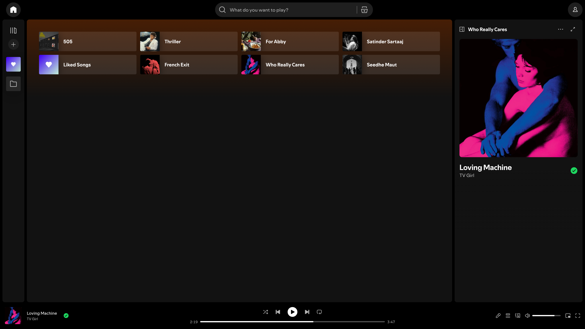
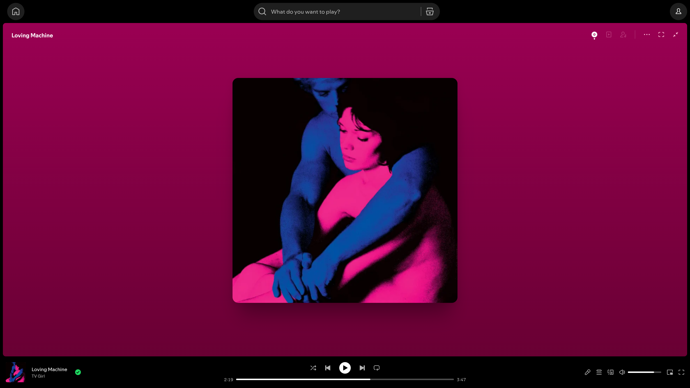
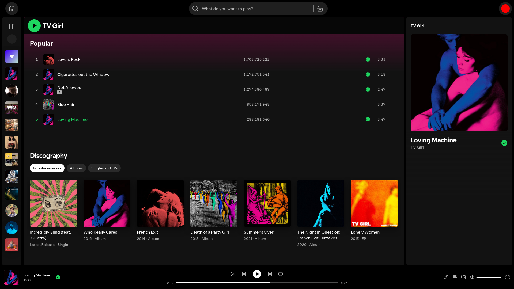

# CLEAN SPOTIFY

Your music, zero distractions, without the clutter.

Platform - Spotify Web
[Install Userstyle](#-installation)

 

### Previews

<h3 align="center">Homepage</h3>

  

 
<h3 align="center">Now Playing</h3>

  

 
<h3 align="center">Artist Page / Album Page</h3>

  

 

## Installation

> [!WARNING]
> Spotify uses dynamic class names - the userstyle may break after updates. For a complete list of class mappings, check the [Class Dictionary](./CLASS_DICTIONARY.md).

> [!NOTE]
> Make sure you have the **[Stylus Extension](https://add-ons.mozilla.org/en-US/firefox/addon/styl-us/)** installed on your browser.

2. Click the button below to install the userstyle:

# 

 

## Interface Cleanups

<b>Header & Navigation</b>

* Hides top-left Spotify Logo
* Hides unnecessary right-side buttons (Upgrade, etc.)
* Centers and beautifully resizes the search bar

<b>Home Page</b>

* Hides "Jump back in" and "Made for you" shelves
* Hides promotional music cards and "Spotify Clips"
* Blocks AI song and AI playlist recommendations

<b>Artist & Media Pages</b>

* Keeps clean **Discography** visible (along with "Show All")
* Hides "On Tour", "About", and promotional cards on Artist page
* Removes card/list recommendations on Album, Playlist, and Track pages

<b>Now Playing & UI Adjustments</b>

* Hides crowded Artist Info in the right sidebar
* Removes vertical scrollbars for a completely flat look
* Hides the global footer container

### Contributing & Bug Reports

Because Spotify updates its web layout frequently, classes will eventually break. If you notice something looks off:

* **Know how to fix it?** Check the [Class Dictionary](./CLASS_DICTIONARY.md) to locate the broken selector, swap in Spotify's new class hash, and open a **Pull Request**! 
* **Just want to report it?** Open a detailed ticket in the [Issues Tab](https://github.com/kaunkrishna/clean-spotify/issues) with a screenshot so someone one can grab it.

---

  <i>Making it worse before it gets better.</i>

