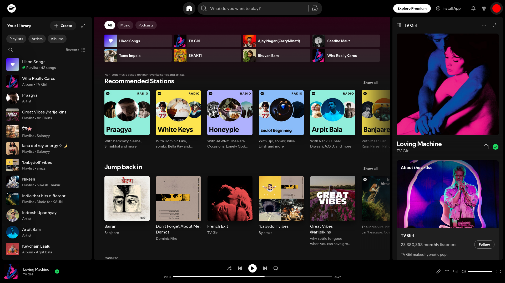
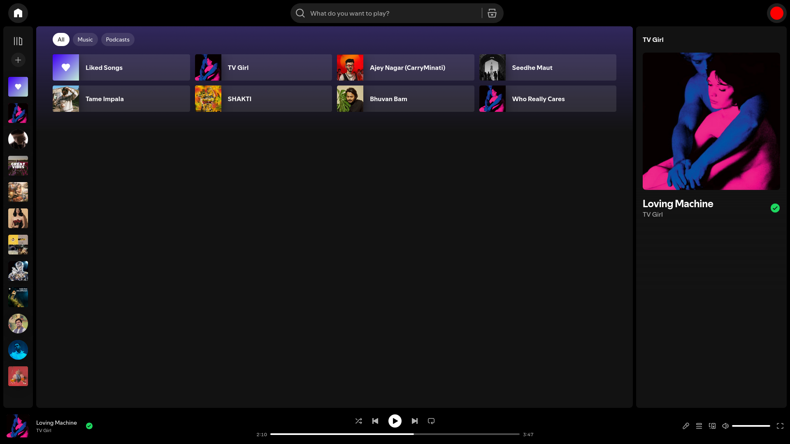
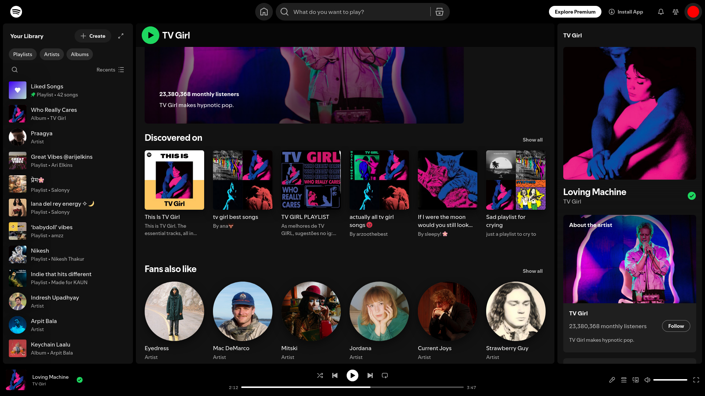
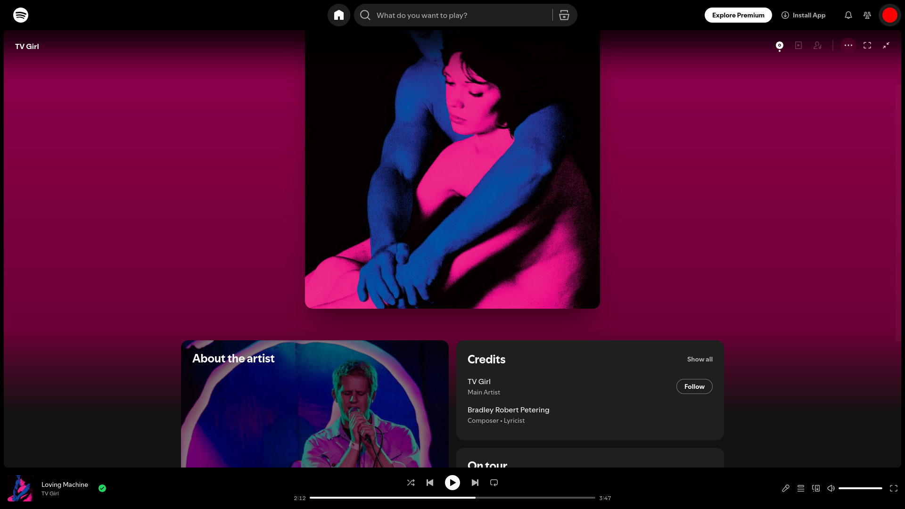
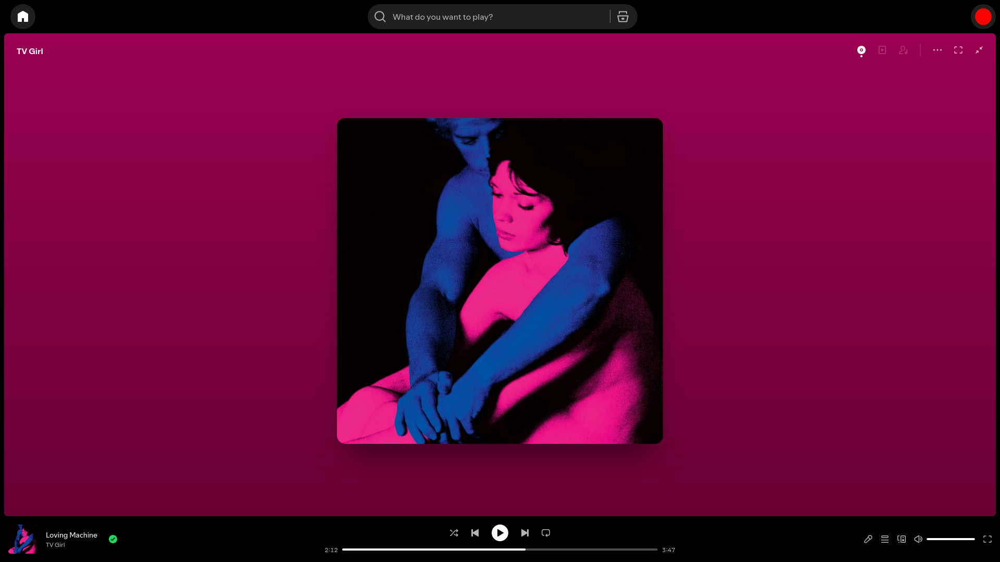

# CLEAN SPOTIFY
Your music, zero distractions, without the clutter.

 

### Preview

<table align="center" cellpadding="12">
  <tr>
    <td align="center" width="50%">
       
      
Homepage (Before)

    </td>
    <td align="center" width="50%">
       
      
Homepage (After)

    </td>
  </tr>
  <tr>
    <td align="center">
       
      
Artist Page (Before)

    </td>
    <td align="center">
       
      
Artist Page (After)

    </td>
  </tr>
  <tr>
    <td align="center">
       
      
Now Playing (Before)

    </td>
    <td align="center">
       
      
Now Playing (After)

    </td>
  </tr>
</table>

 

### WHY THIS EXISTS?

Spotify Web is powerful, but cluttered, and often distracting. 
This project removes distractions and keeps only what matters: **YOUR MUSIC.**

 

### Requirements

* Stylus extension
* Ad blocker (uBlock Origin recommended)

 

### INSTALLATION

Click on the link below to install the userstyle:
#### [INSTALL CLEAN SPOTIFY](https://raw.githubusercontent.com/kaunkrishna/clean-spotify/main/userstyle/clean-spotify.user.css)

 

### NOTE

* Spotify uses dynamic class names - may break after updates
* Report bugs in the Issues tab

 

#### LICENSE: OPEN SOURCE, Fork and improve it

 

  <i>Making it worse before it gets better.</i>

